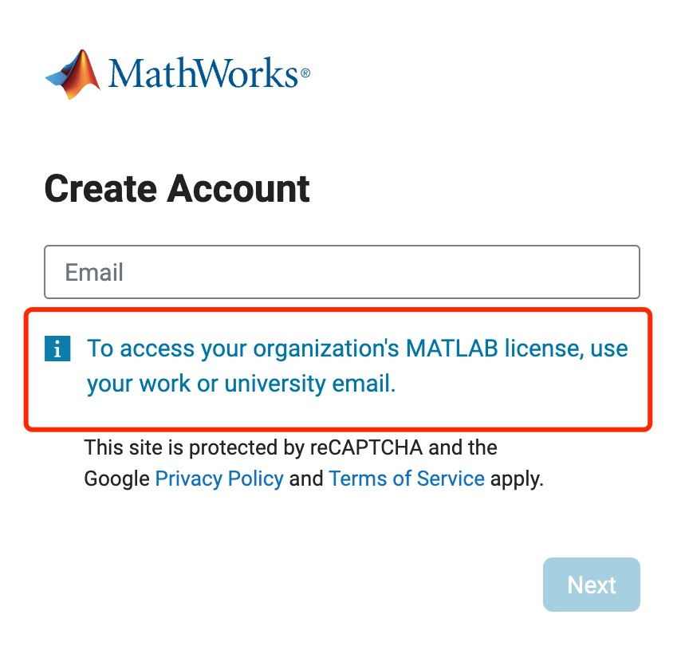

# 安装Matlab


由于我们需要安装Simulink for Raspberry Pi 。 虽然网上提供了很多Matlab 破解版的资源，但是任何一个破解版，都不包括了与硬件相关的Add-On的安装方式，并且Add-On的安装是联网激活的，所以无法在破解版进行安装，由于该扩展功能可以大大缩短我们的开发时间，在咨询Mathworks公司的工程师后，他们建议我们下载试用版，到期后再换一个账号，很多Mathworks的雇员目前也经常在自家安装试用版。所以本文主要介绍如何安装matlab 2024b试用版


## 准备一个工作邮箱

Matlab官网需要工作邮件才能注册账号，通过该注册的账号，我们才能够下载试用版。下图为创建账号时的弹出页面，注意它指明需要填写**工作邮件**或者**学校邮箱**。由于毕业后学校会自动注销我们在学校的邮箱，所以使用试用版本的matlab时，需要我们准备一个工作邮箱。

<figure><figcaption>
matlab 创建账号注意
</figcaption></figure>

如果有之前公司尚未注销掉的工作邮箱，那么准备工作邮箱的工作基本上就已经完成了，可以直接进入[安装步骤](an-zhuang-matlab.md#an-zhuang-shi-yong-ban-matlab)。

若非常不幸运的已经既没有工作邮件又没有学校邮箱，那么可以前往[网易企业邮箱注](https://qiye.163.com/)册一个企业，然后同样的**“试用”**一下，由于这部分并未实操，所以更加详细的步骤进行说明，请大家自行解决。 一个另外可行的方法，就是借用一下朋友的企业邮箱。（但由于毕竟是商业行为，所以请酌情自行处理）

## 注册mathworks账号

在[mathworks官网](https://www.mathworks.com/)，Sign in 处登陆，初次登陆没有账号的情况下，弹出的窗口处点击创建账号。

<figure><figcaption>
注册账号
</figcaption></figure>


由于网站的界面时常会变化，上述只是给出撰写文档时的注册方法，实际注册方法会随着mathworks公司更新官网UI而改变，请注意此步骤的目的是为了注册账号，请根据官网的指引完成账号的注册。


## 安装试用版Matlab

如果已经准备好了工作邮箱，那一切都会变得无比简单，因为我们目前是一个尊贵的正版用户，所以在官网找到下载试用版matlab的链接即可。虽然之前写的介绍是如何下载安装Matlab2024b，但实际上如果到了25年，由于我们是正版用户的关系，直接下载最新的正版软件即可。Mathworks官网会在线生成一个安装包供我们安装matlab。

下载完成后，打开安装包，登陆我们在第二步中[注册的mathworks账号](an-zhuang-matlab.md#zhu-ce-mathworks-zhang-hao)，一路同意以及next，来到选择安装包。

<figure><figcaption>
登陆mathworks账号
</figcaption></figure>

安装时只需要安装如下两个包即可：

<figure><figcaption>
选择产品
</figcaption></figure>


理论上可以全部安装，但是本项目只用到了这两个，所以其他的不需要装，并且也是试用版，所以没用到的到时候也还是需要卸载，所以不推荐多装额外很多用不到的产品。


继续一路默认即可完成安装。
